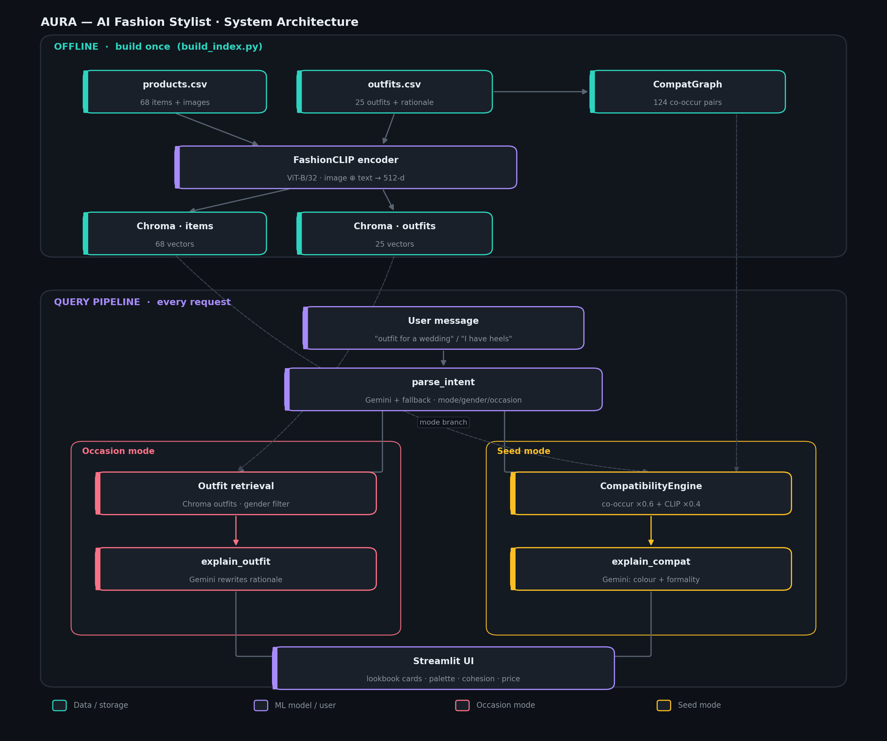

# AURA — AI Fashion Outfit Recommendation System
**Dare XAI · ML & AI Engineer Intern Assignment**

A conversational fashion stylist. Describe an occasion or an item you own — AURA returns a complete, compatible outfit with a reason for every pick. Built on FashionCLIP embeddings, ChromaDB vector retrieval, a co-occurrence + similarity-transfer compatibility engine, and Gemini for intent parsing and grounded explanations.

---

## System Architecture



---

## Requirements → code

| # | Requirement | File |
|---|---|---|
| 1 | Dataset analysis | `src/inspect_dataset.py` → `docs/dataset_analysis.md` |
| 2 | Compatibility engine | `src/compatibility.py` + `src/data.py` |
| 3 | User-aware recommendations | `src/llm.py` (intent) + `src/app.py` (profile sidebar) |
| 4 | Conversational assistant | `src/app.py` (Streamlit chat) |
| 5 | Explainability | `src/llm.py` (Gemini rewrites expert rationale) |

---

## Technical approach

### FashionCLIP — Computer Vision
Model: `patrickjohncyh/fashion-clip` (ViT-B/32, fashion fine-tuned). Each item embedded as the normalised mean of image + text vectors (512-d). Joint embedding space means text queries match image-derived vectors out of the box.

### Hybrid compatibility engine
Two signals are fused because the data is sparse: only 19/68 items appear in more than one outfit, making co-occurrence alone weak (leave-one-out recall@5 ≈ 19%).

- **Co-occurrence** (weight 0.6) — which items actually appear together in the 25 curated outfits
- **Similarity-transfer** (weight 0.4) — borrow partners from FashionCLIP-similar items (memory-based CF with a visual kernel)

### ChromaDB retrieval
Two persistent collections: `items` (68 vectors) and `outfits` (25 vectors). Outfit retrieval uses dense ANN + metadata `where` filter on gender. Item similarity uses in-memory matrix multiply across the 68-item matrix.

### RAG pipeline
Nearest curated outfit → `theme` + `palette` + `stylist_rationale` passed to Gemini → response rewritten for the user's specific query. Grounded, not invented. System works fully without a Gemini key (rationale used directly as fallback).

### Evaluation
| Method | Recall@3 | Recall@5 |
|---|---|---|
| Co-occurrence only (baseline) | 17% | 19% |
| + FashionCLIP similarity-transfer | run `python src/eval.py` | — |

---

## Setup

```bash
git clone https://github.com/samsadar236/fashionstylist-ai.git
cd fashionstylist-ai
python -m venv .venv
.\.venv\Scripts\Activate.ps1          # Windows
pip install -r requirements.txt
git clone https://github.com/DarexAI-AI-Startup/ML-TASK.git data
# Optional Gemini key (system runs without it)
$env:GEMINI_API_KEY = "your_key"
```

## Run

```bash
python src/inspect_dataset.py   # dataset analysis — no model needed
python src/eval.py              # co-occurrence baseline
python src/build_index.py       # embed 68 items → ChromaDB (one-time, ~2 min)
python src/recommend.py "smart casual for a dinner date, 24M"
python src/recommend.py "what goes with my white formal shirt?"
python src/compat_model.py      # optional: learned pairwise scorer
streamlit run src/app.py        # demo UI
```

> Run all commands from the project root (where `config.py` lives).

---

## File structure

```
config.py                  Paths, model IDs, fusion weights
src/
  data.py                  CSV loaders, image resolver, co-occurrence graph
  embeddings.py            FashionCLIP wrapper (transformers)
  build_index.py           Embed items + outfits → ChromaDB (run once)
  inspect_dataset.py       Req 1: dataset analysis
  compatibility.py         Req 2: co-occur + similarity-transfer engine
  compat_model.py          Optional: learned pairwise compatibility scorer
  retriever.py             Outfit ANN + item similarity_fn + cohesion score
  llm.py                   Intent parsing + grounded explanations
  recommend.py             Orchestrator: occasion + seed modes
  eval.py                  Leave-one-out recall evaluation
  app.py                   Streamlit conversational UI
docs/
  architecture.md          Detailed design rationale
  dataset_analysis.md      Generated by inspect_dataset.py
```

---

## Design decisions

**Outfit-centric.** The dataset provides 25 expert outfits with rationales — recommending from proven combinations and grounding explanations in real stylist copy beats assembling pieces from scratch.

**Fusion justified by measurement.** Co-occurrence alone hits 17% recall@3. The embedding similarity-transfer path generalises across the sparsity gap.

**Graceful degradation.** No Gemini key → stylist rationale used directly (already expert copy). No internet → index is pre-built. Full functionality in both scenarios.

**Honest limitations.** 68-item catalog: the system returns the closest real item, never invents one. On-model lifestyle images add background noise to embeddings (future: garment segmentation). Co-occurrence graph is sparse by design.

---

## Future improvements
- Garment segmentation before embedding (remove background noise from lifestyle shots)
- Dense + BM25 sparse hybrid retrieval
- Trained compatibility head (OutfitTransformer-style on Polyvore)
- Graph neural network (NGNN/HGNN) over the co-occurrence graph
